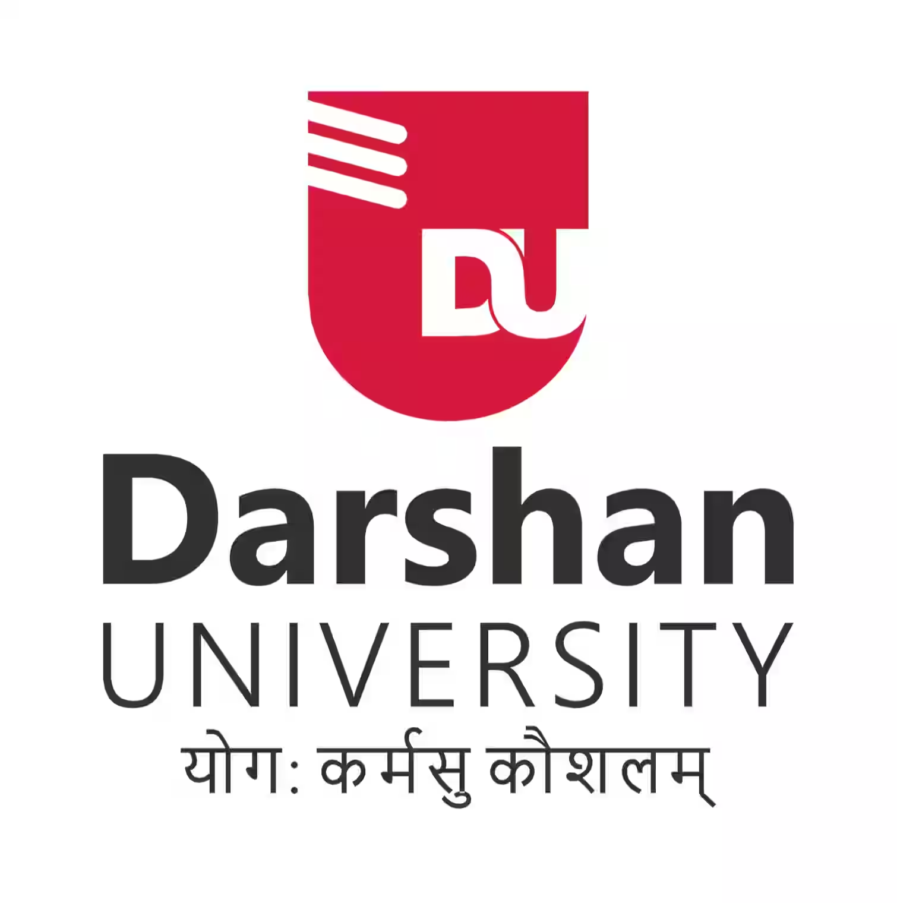

<p align="center">
  
</p>

<h1 align="center">🤖 Darshan University AI Assistant — RAG Chatbot</h1>

<p align="center">
  <em>An intelligent, context-aware chatbot powered by Retrieval-Augmented Generation (RAG) that answers questions about Darshan University using real, scraped data from the official website.</em>
</p>

<p align="center">
  
  
  
  
  
  
</p>

---

## 📖 About The Project

The **Darshan University AI Assistant** is a fully offline, privacy-first RAG (Retrieval-Augmented Generation) chatbot built to answer student queries about Darshan University — including **courses, departments, placements, faculty, and general information** — using real data scraped directly from the [official Darshan University website](https://darshan.ac.in).

Unlike traditional chatbots that rely on cloud APIs, this system runs **entirely locally** using **Ollama + Phi-3**, ensuring zero data leaves the machine. The chatbot retrieves the most relevant information chunks from a ChromaDB vector database and generates accurate, grounded answers — never hallucinating or inventing facts.

### ✨ Key Highlights

- 🔒 **Fully Offline & Private** — No external API calls; everything runs locally via Ollama
- 🎯 **Grounded Answers Only** — Strict prompt engineering ensures the bot only answers from retrieved context
- 🕷️ **Automated Data Pipeline** — Scrapy-based crawler + cleaning + chunking + embedding pipeline
- 📊 **Placement Data Support** — Custom semantic extractor for detailed placement statistics (2016–2026)
- 💬 **Conversational Memory** — Session-based history for follow-up questions (e.g., "And for MCA?")
- 🎨 **Beautiful Chat UI** — Dark-themed, floating chat widget styled to match Darshan University branding

---

## 🏆 Achievements

<table>
  <tr>
    <td>🏅</td>
    <td>
      <strong>Certificate of Appreciation — Darshan University</strong><br/>
      <em>Felicitated by Darshan University for developing the <strong>Darshan University AI Assistant (RAG Chatbot)</strong>.</em><br/><br/>
      Recognized and appreciated by the university administration for building an intelligent AI-powered assistant that serves students and stakeholders with accurate, real-time information about Darshan University.
    </td>
  </tr>
</table>

---

## 🏗️ System Architecture

```
┌─────────────────────────────────────────────────────────────────────┐
│                        DATA PIPELINE                                │
│                                                                     │
│  darshan.ac.in ──► Scrapy Crawler ──► Raw JSONL ──► Dedupe & Clean  │
│                                                          │          │
│                                              Post Clean ◄┘          │
│                                                  │                  │
│                                          Filter for Index           │
│                                                  │                  │
│                                           Make Chunks               │
│                                                  │                  │
│                                    MiniLM Embeddings + ChromaDB     │
└─────────────────────────────────────────────────────────────────────┘

┌─────────────────────────────────────────────────────────────────────┐
│                        QUERY PIPELINE                               │
│                                                                     │
│  User Question ──► Flask API ──► Similarity Search (ChromaDB)       │
│                                        │                            │
│                              Top-K Relevant Chunks                  │
│                                        │                            │
│                              Build Grounded Prompt                  │
│                                        │                            │
│                              Ollama (Phi-3) LLM                     │
│                                        │                            │
│                              Answer ──► Chat UI                     │
└─────────────────────────────────────────────────────────────────────┘
```

---

## 🛠️ Tech Stack

| Layer | Technology | Purpose |
|-------|-----------|---------|
| **Web Scraping** | Scrapy, readability-lxml, trafilatura | Crawl & extract content from darshan.ac.in |
| **Embeddings** | HuggingFace `all-MiniLM-L6-v2` | Convert text chunks into vector embeddings |
| **Vector Database** | ChromaDB | Store and retrieve document embeddings locally |
| **LLM** | Ollama + Phi-3 | Generate grounded answers from retrieved context |
| **Framework** | LangChain | Orchestrate embeddings ↔ vector store integration |
| **Backend** | Flask | REST API (`/api/chat`) for chat interactions |
| **Frontend** | HTML, CSS, JavaScript (Vanilla) | Dark-themed floating chat widget UI |

---

## 📁 Project Structure

```
RAG-Chatbot-DarshanUniversity/
│
├── app.py                      # Flask web server & chat API endpoints
├── main.py                     # Core RAG logic (embeddings, retrieval, prompt, LLM)
├── scrape_placements.py        # Dedicated placement data scraper (2016–2026)
├── run_pipeline.bat            # One-click data pipeline runner (Windows)
├── requirements.txt            # Python dependencies
├── scrapy.cfg                  # Scrapy project configuration
├── planning.md                 # Tech stack & architecture documentation
│
├── du_scraper/                 # Scrapy spider package
│   ├── spiders/
│   │   └── darshan_university.py   # Main spider — crawls darshan.ac.in
│   ├── utils/
│   │   └── extract.py          # HTML extraction & text cleaning utilities
│   ├── extensions.py           # Custom Scrapy extensions
│   ├── items.py                # Scrapy item definitions
│   ├── middlewares.py          # Custom middlewares
│   ├── pipelines.py            # Data processing pipelines
│   └── settings.py             # Scrapy settings (throttle, cache, etc.)
│
├── scripts/                    # Data processing pipeline scripts
│   ├── dedupe_clean.py         # Step 1: Remove duplicate pages
│   ├── post_clean.py           # Step 2: Post-processing & text cleanup
│   ├── filter_for_index.py     # Step 3: Filter pages suitable for indexing
│   ├── make_chunks.py          # Step 4: Split documents into chunks
│   └── build_chroma.py         # Step 5: Build ChromaDB vector store
│
├── templates/
│   └── index.html              # Chat UI (dark-themed floating widget)
│
└── data/                       # Generated data (not committed to git)
    ├── raw/                    # Raw scraped JSONL files
    ├── clean/                  # Cleaned & deduplicated data
    ├── chunks/                 # Chunked documents (chunks.jsonl)
    └── chroma_db/              # ChromaDB vector database files
```

---

## 💬 Usage

1. Click the **red chat icon** (bottom-right corner) to open the chat window
2. Type any question about Darshan University, for example:
   - *"What courses does Darshan University offer?"*
   - *"What is the placement record for B.Tech Computer in 2025?"*
   - *"Tell me about the MCA department"*
   - *"What was the highest package in 2024?"*
3. The bot retrieves relevant information from the vector database and generates a grounded answer
4. Follow-up questions are supported — the chatbot remembers conversation context!


## 📄 License

This project is open source and available under the [MIT License](LICENSE).

---

## 👨‍💻 Author

**Smit Ranipa**

- GitHub: [@SmitRanipa](https://github.com/SmitRanipa)

---

<p align="center">
  Made with ❤️ for Darshan University
</p>
